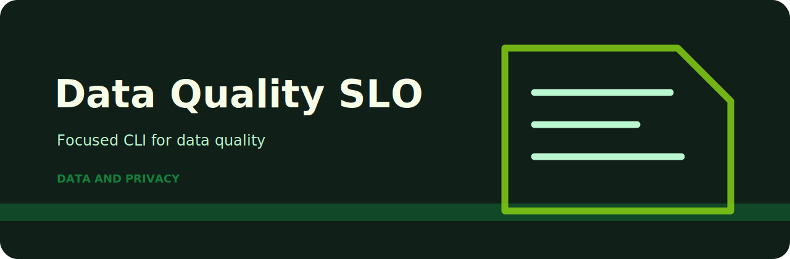
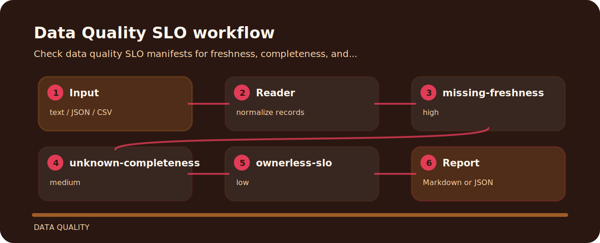

# Data Quality SLO

| Detail | Value |
| --- | --- |
| Area | data quality |
| Entry | `data-quality-slo` |
| Input | plain text |
| Output | terminal findings, optional JSON |

## Rule ledger

- `missing-freshness` - freshness SLO missing (high); define freshness target.
- `unknown-completeness` - completeness SLO missing (medium); define completeness target.
- `ownerless-slo` - SLO owner missing (low); assign owner.



## Signal route



## Command path

```bash
git clone https://github.com/mertefekurt/data-quality-slo.git
cd data-quality-slo
python -m pip install -e ".[dev]"
data-quality-slo examples/sample.txt
```
